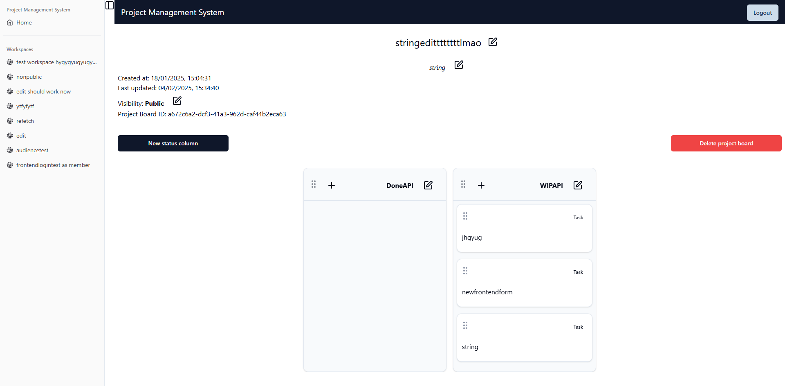

<a id="readme-top"></a>

<br />
<div align="center">

  <h3 align="center">Project Management System</h3>

  <p align="center">
    An awesome project management system!
    <br />
    <a href="https://github.com/aidbar/fs19_frontend"><strong>Explore the repository »</strong></a>
    <br />
    <br />
    <a href="deployment.com">View Demo</a>
    &middot;
    <a href="mailto:aide.barniskyte@integrify.io">Report Bug</a>
    &middot;
    <a href="mailto:aide.barniskyte@integrify.io">Request Feature</a>
  </p>
</div>

<details>
  <summary>Table of Contents</summary>
  <ol>
    <li>
      <a href="#about-the-project">About The Project</a>
      <ul>
        <li><a href="#built-with">Built With</a></li>
      </ul>
    </li>
    <li>
      <a href="#getting-started">Getting Started</a>
      <ul>
        <li><a href="#prerequisites">Prerequisites</a></li>
        <li><a href="#installation">Installation</a></li>
      </ul>
    </li>
    <li><a href="#technical-overview">Technical Overview</a></li>
    <li><a href="#folder-structure-and-explanation">Folder Structure and Explanation</a></li>
    <li><a href="#usage">Usage</a></li>
    <li><a href="#roadmap">Roadmap</a></li>
  </ol>
</details>

## About The Project

[](./screenshot.png)

This repository contains a frontend of a project management system, which allows users to create, update and delete workspaces, project boards and tasks. The frontend is built using React 19, TypeScript, Tailwind CSS, Shadcn, and Tanstack/react-query, while focusing on modern frontend development practices. The goal of the system frontend is to provide a pleasant, responsive and interactive user experience.

[View Screenshot](./screenshot.png)

<p align="left">(<a href="#readme-top">back to top</a>)</p>

### Built With

* [![React][React.js]][React-url]
* [![TypeScript][TypeScript]][TypeScript-url]
* [![Tailwind CSS][TailwindCSS]][TailwindCSS-url]
* [![Shadcn][Shadcn]][Shadcn-url]
* [![Tanstack/react-query][Tanstack]][Tanstack-url]

<p align="left">(<a href="#readme-top">back to top</a>)</p>

## Getting Started

To get a local copy up and running, follow these simple steps:

### Prerequisites

* **yarn**
  ```sh
  npm install --global yarn
  ```

* **Backend**
  Follow the instructions provided in the [backend repository](https://github.com/aidbar/fs19_CSharp_Teamwork) to set up and run the system backend.

<p align="left">(<a href="#readme-top">back to top</a>)</p>

### Installation

1. Clone the repository:
    ```sh
    git clone <repository-url>
    cd fs19_frontend
    ```
2. Install dependencies:
    ```sh
    yarn install
    ```
3. Run the development server:
    ```sh
    yarn dev
    ```
4. Build for production:
    ```sh
    yarn build
    yarn start
    ```

<p align="left">(<a href="#readme-top">back to top</a>)</p>

## Technical Overview

This section provides a high-level overview of the technical aspects of the project.

### Frontend

The frontend of this project is built using the following technologies:
- **React 19**: A JavaScript library for building user interfaces.
- **TypeScript**: A typed superset of JavaScript that compiles to plain JavaScript.
- **Tailwind CSS**: A utility-first CSS framework for rapid UI development.
- **Shadcn**: A component library for building modern web applications.
- **Tanstack/react-query**: A library for fetching, caching, and updating asynchronous data in React.

### Project Structure

The project follows a modular structure, with separate directories for components, pages, contexts, and utilities. This structure helps in maintaining a clean and organized codebase.

### State Management

State management is handled using React's Context API, which provides a way to share state across the entire application without passing props down manually at every level.

### API Integration

API integration is done using custom hooks and services defined in the `api` directory. These services handle HTTP requests and manage data fetching, caching, and synchronization with the backend.

<p align="left">(<a href="#readme-top">back to top</a>)</p>

## Folder Structure and Explanation

```
├── README.md
├── components.json
├── directory_structure.txt
├── index.html
├── package.json
├── postcss.config.js
├── public
│   └── vite.svg
├── src
│   ├── App.css
│   ├── App.tsx
│   ├── api
│   │   ├── index.ts
│   │   ├── task-management.ts
│   │   └── tasks.ts
│   ├── components
│   │   ├── CreateTaskPopup.tsx
│   │   ├── DeleteConfirmationPopup.tsx
│   │   ├── Header.tsx
│   │   ├── KanbanBoard.tsx
│   │   ├── LoginPopup.tsx
│   │   ├── ProjectBoardPopup.tsx
│   │   ├── ProjectBoardsTable.tsx
│   │   ├── SignupPopup.tsx
│   │   ├── StatusPopup.tsx
│   │   ├── TaskCardPopup.tsx
│   │   ├── WorkspacePopup.tsx
│   │   ├── WorkspacesTable.tsx
│   │   └── ui
│   │       ├── badge.tsx
│   │       ├── board-column.tsx
│   │       ├── button.tsx
│   │       ├── calendar.tsx
│   │       ├── card.tsx
│   │       ├── checkbox.tsx
│   │       ├── dropdown-menu.tsx
│   │       ├── dropdown.tsx
│   │       ├── input.tsx
│   │       ├── navmenu.tsx
│   │       ├── popover.tsx
│   │       ├── scroll-area.tsx
│   │       ├── table.tsx
│   │       └── task-card.tsx
│   ├── context
│   │   ├── ColumnsContext.tsx
│   │   ├── PrioritiesContext.tsx
│   │   └── TasksContext.tsx
│   ├── index.css
│   ├── lib
│   │   ├── dnd.ts
│   │   └── utils.ts
│   ├── main.tsx
│   ├── pages
│   │   ├── Dashboard.tsx
│   │   ├── LoggedOut.tsx
│   │   ├── ProjectBoard.tsx
│   │   ├── Workspace.tsx
│   │   └── home.tsx
│   ├── schemas
│   │   └── tasks.ts
│   ├── types
│   │   └── index.ts
│   └── vite-env.d.ts
├── tailwind.config.js
├── tsconfig.json
├── tsconfig.node.json
├── vite.config.ts
└── yarn.lock
```

- **README.md**: Project documentation.
- **components.json**: Configuration file for components.
- **directory_structure.txt**: Text file containing the directory structure.
- **index.html**: Main HTML file.
- **package.json**: Configuration file for React.
- **postcss.config.js**: Configuration file for PostCSS.
- **public**: Contains public assets like images and fonts.
  - **vite.svg**: Vite logo.
- **src**: Contains source files including global and component-specific styles.
  - **App.css**: Global CSS styles.
  - **App.tsx**: Main application component.
  - **api**: Contains API service files for making HTTP requests.
    - **index.ts**: API index file.
    - **task-management.ts**
    - **tasks.ts**
  - **components**: Contains React components used in the app's pages.
    - **CreateTaskPopup.tsx**
    - **DeleteConfirmationPopup.tsx**: Reusable component for delete confirmation.
    - **Header.tsx**
    - **KanbanBoard.tsx**
    - **LoginPopup.tsx**
    - **ProjectBoardPopup.tsx**
    - **ProjectBoardsTable.tsx**
    - **SignupPopup.tsx**
    - **StatusPopup.tsx**
    - **TaskCardPopup.tsx**
    - **WorkspacePopup.tsx**
    - **WorkspacesTable.tsx**
    - **ui**: Contains UI elements used in components.
      - **badge.tsx**.
      - **board-column.tsx**
      - **button.tsx**
      - **calendar.tsx**
      - **card.tsx**
      - **checkbox.tsx**
      - **dropdown-menu.tsx**
      - **dropdown.tsx**
      - **input.tsx**
      - **navmenu.tsx**
      - **popover.tsx**
      - **scroll-area.tsx**
      - **table.tsx**
      - **task-card.tsx**
  - **context**: Contains context providers for state management.
    - **ColumnsContext.tsx**
    - **PrioritiesContext.tsx**
    - **TasksContext.tsx**
  - **index.css**: Global CSS styles.
  - **lib**: Contains utility files.
    - **dnd.ts**: Drag and drop utilities.
    - **utils.ts**: General utilities.
  - **main.tsx**: Main entry point for the application.
  - **pages**: Contains the pages used in the application.
    - **Dashboard.tsx**: Dashboard page (user's homepage).
    - **LoggedOut.tsx**: Page displayed after successfully logging out.
    - **ProjectBoard.tsx**: Project board page.
    - **Workspace.tsx**: Workspace page.
    - **home.tsx**: Home page.
  - **schemas**: Contains schema definitions.
    - **tasks.ts**
  - **types**: Contains TypeScript type definitions.
    - **index.ts**: Index of type definitions.
  - **vite-env.d.ts**: Vite environment definitions.
- **tailwind.config.js**: Configuration file for Tailwind CSS.
- **tsconfig.json**: TypeScript configuration file.
- **tsconfig.node.json**: Node-specific TypeScript configuration.
- **vite.config.ts**: Vite configuration file.
- **yarn.lock**: Yarn lock file.

<p align="left">(<a href="#readme-top">back to top</a>)</p>

## Roadmap

- Improve user feedback
- Create an utilize API endpoints for more specific data retrieval
- Persist the change of a task's status when the task is moved to a different column
- Utilize state for updating components in `Workspace.tsx` and `ProjectBoard.tsx` instead of refecthing
- Create tests
- Ensure responsiveness and accessibility
- Implement "assigned users" feature
- Implement refresh token
- Refactor code to separate business logic from UI

<p align="left">(<a href="#readme-top">back to top</a>)</p>

<!-- MARKDOWN LINKS & IMAGES -->
[contributors-shield]: https://img.shields.io/github/contributors/your_username/repo_name.svg?style=for-the-badge
[contributors-url]: https://github.com/your_username/repo_name/graphs/contributors
[forks-shield]: https://img.shields.io/github/forks/your_username/repo_name.svg?style=for-the-badge
[forks-url]: https://github.com/your_username/repo_name/network/members
[stars-shield]: https://img.shields.io/github/stars/your_username/repo_name.svg?style=for-the-badge
[stars-url]: https://github.com/your_username/repo_name/stargazers
[issues-shield]: https://img.shields.io/github/issues/your_username/repo_name.svg?style=for-the-badge
[issues-url]: https://github.com/your_username/repo_name/issues
[license-shield]: https://img.shields.io/github/license/your_username/repo_name.svg?style=for-the-badge
[license-url]: https://github.com/your_username/repo_name/blob/master/LICENSE.txt
[linkedin-shield]: https://img.shields.io/badge/-LinkedIn-black.svg?style=for-the-badge&logo=linkedin&colorB=555
[linkedin-url]: https://linkedin.com/in/your_username
[product-screenshot]: images/screenshot.png
[React.js]: https://img.shields.io/badge/React-20232A?style=for-the-badge&logo=react&logoColor=61DAFB
[React-url]: https://reactjs.org/
[TypeScript]: https://img.shields.io/badge/TypeScript-007ACC?style=for-the-badge&logo=typescript&logoColor=white
[TypeScript-url]: https://www.typescriptlang.org/
[TailwindCSS]: https://img.shields.io/badge/TailwindCSS-38B2AC?style=for-the-badge&logo=tailwind-css&logoColor=white
[TailwindCSS-url]: https://tailwindcss.com/
[Shadcn]: https://img.shields.io/badge/Shadcn-000000?style=for-the-badge&logo=shadcn&logoColor=white
[Shadcn-url]: https://shadcn.dev/
[Tanstack]: https://img.shields.io/badge/Tanstack-FF4154?style=for-the-badge&logo=react-query&logoColor=white
[Tanstack-url]: https://tanstack.com/query/latest

